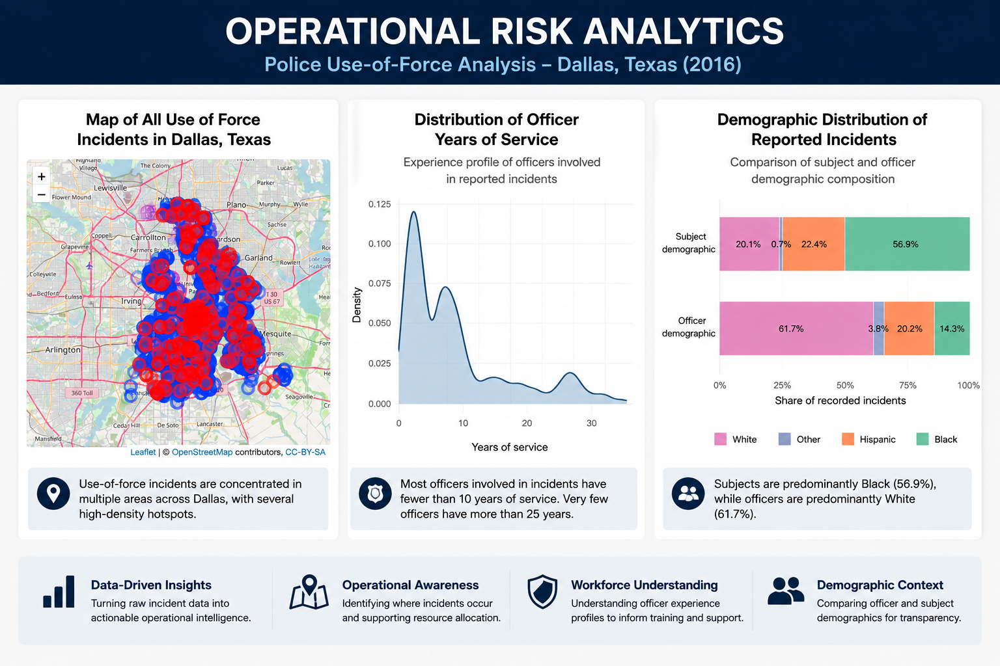

# Operational Risk Analytics Using Police Incident Data
### Identifying Spatial, Temporal and Workforce Patterns to Support Operational Decision-Making

## Project Overview
This project applies Exploratory Data Analysis (EDA) to the Dallas Police Department Use-of-Force dataset published by the Center for Policing Equity (CPE).

The objective is to demonstrate how operational incident data can be transformed into actionable business intelligence through statistical analysis and data visualization.

Rather than focusing solely on descriptive statistics, the project investigates operational patterns across multiple analytical dimensions to support evidence-based decision-making.

## Objectives
- Identify operational hotspots using geospatial analysis
- Analyse temporal trends and seasonal patterns
- Explore demographic characteristics of officers and subjects
- Investigate operational reasons and response actions
- Examine workforce experience distributions
- Produce evidence-based operational recommendations

## Dataset
Source
Center for Policing Equity (CPE)
Dallas Police Department Use-of-Force Dataset (2016)

## Analytical Workflow
1. Data Preparation
2. Exploratory Data Analysis (EDA)
3. Geospatial Analysis
4. Time Series Analysis
5. Operational Circumstances Analysis
6. Correlation Analysis
7. Operational Response Analysis
8. Demographic Analysis
9. Workforce Analytics
10. Operational Insights

## Key Insights
- Operational incidents are geographically clustered rather than evenly distributed.
- Arrests account for the largest proportion of use-of-force incidents.
- Incident frequency varies across both months and hours of the day.
- Operational response actions are dominated by verbal commands and suspect restraint techniques.
- Officer and subject demographic distributions differ considerably.
- Officers with fewer years of service appear more frequently in reported incidents.

## Visualisations
Scatter Plot
Interactive Leaflet Maps
Time Series Plot
Histogram
Density Plot
Correlation Heatmap
Stacked Bar Chart
Horizontal Bar Chart
Bubble Chart (Plotly)

## Technologies
- R
- tidyverse
- ggplot2
- leaflet
- plotly
- sf
- lubridate
- knitr

## Skills Demonstrated
- Data Cleaning
- Exploratory Data Analysis (EDA)
- Data Visualization
- Geospatial Analytics
- Time Series Analysis
- Statistical Analysis
- Operational Analytics
- Business Intelligence
- Data Storytelling
- Evidence-Based Decision Making

## Business Value
This project demonstrates how operational data can be used to identify patterns, support resource allocation, improve situational awareness, and inform operational planning. While the analysis is descriptive rather than causal, it illustrates a practical workflow for transforming raw incident records into meaningful operational insights.

